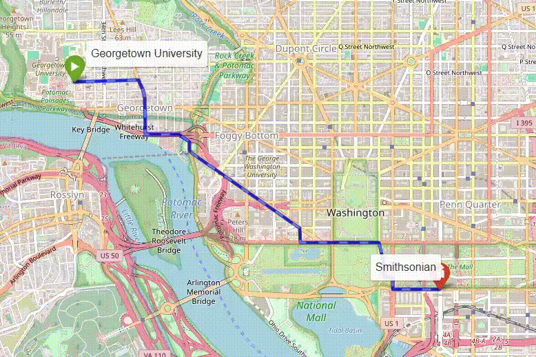

## Setup

Create a conda environment with python 3.12

```bash
conda create -n pathfinder python=3.12
conda activate pathfinder
```

Install requirements

```bash
python3 -m pip install -r requirements.txt
```

## Usage

Generate a map of a given location with 

```bash
# args: map location, save-path, map type (drive, bike, walk)
python3 get_map.py "Washington, District of Columbia, USA" maps/drive_map.graphml drive
```

Render an interactive visualization of the shortest path between two points

```python
from astar import astar
form visualize import visualize

# load saved map from earlier step
drive_map = ox.load_graphml("maps/drive_map.graphml")

# some points of interest
poi = {
    "Georgetown University": (38.9076, -77.0723),
    "Smithsonian": (38.8881, -77.0260),
}

# get nearest nodes to the locations
start = ox.distance.nearest_nodes(
    drive_map, poi["Georgetown University"][1], poi["Georgetown University"][0]
)
end = ox.distance.nearest_nodes(
    drive_map, poi["Smithsonian"][1], poi["Smithsonian"][0]
)

# render the route visualization
visualize(
    G=drive_map,                                # networkx graph
    start=start,                                # start node
    end=end,                                    # end node
    pathfinder=astar,                           # pathfinding algorithm
    s_label="Georgetown University",            # start node label
    t_label="Smithsonian",                      # end node label
    save_location="plots/drive_map.html"        # path to save html file to 
)
```



For an interactive view of the above map, open [this html file](plots/drive_map.html) in your browser.